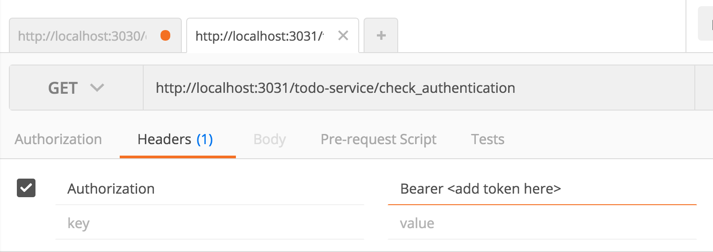

## DOCKERIZE

Steps to recreate:

We are using [docker compose](https://docs.docker.com/compose/) to encapsulate and fire up our micro-services. There is a single _docker-compose.yml_ file in the root of the whole project which defines the relationship between of each of our services and also how to start/build each service. It is necessary to create a _Dockerfile_ within each micro-service to define the micro-service itself (i.e. which docker image to use, set-up and build steps, etc).

The micro-services do not know about each other through the file structure. They have limited interaction on start-up only because of the _docker-compose.yml_ file.

Database:

The database is created because a call to create.sql, which we wrote and placed into the _db/_ folder (micro-service). This call is made because it is specified in the _Dockerfile_ of the database micro-service.

run the knex database migrations, in the command line from within _app/_:

```sh
sh migrate.sh
```

The distributed system:

Build and launch, in the root directory run:

```sh
docker-compose up --build -d
```
> `-d` runs the containers in the background
> `--build` will build any containers that has not been built yet

Want to see logs of all containers? `docker-compose logs`
Want to see logs of a specific container? `docker-compose logs <container-name>`
Want to keep them running? add a `-f`

#### Test it out
In Postman hit `http://localhost:3030/auth/register` with a "raw" body of type JSON posting this object:
```
{
  "user":
    {
      "username": topleft",
      "password": "topleft"
    }
}
```

If all is working you will get back a token and a success message.

Now, take that token and use hit `localhost:3031/todo-service/check_authentication`. If using Postman:



A note about docker container file structure:

When docker builds the container it creates an _app/_ directory and puts your working directory within that. So in your _docker-compose.yml_, when specifying volumes, be sure to use the _app/_ as the root of the path.

If you need to connect to the dockerized db:

```sh
psql -h localhost -p 5433 -d whats_up_doc_development -U admin
```

Run the tests:

```sh
docker-compose run user-service npm test
```

TODOs:

- ~~get gulp live reload happening so that we don't have to rebuild the project with every code change~~
- ~~set up another node app that does something trivial to test authentication~~
 - ~~the idea is that once authenticated through the user-service other services will accept the same token to allow access~~
- make a todo crud hitting the same db as users are stored in
 - GET
   - seed
   - tests
   - routes
 - POST
   - tests
   - routes
 - PUT
   - tests
   - routes
 - DELETE
   - tests
   - routes

- make another service that hits an api: pokemon api, gihub api, nytimes api?
- implement a static service to serve up client side that hits all services allowing interaction by user
 - build in Angular
 - use webpack
- implement flask app
 - that will accept the token to allow access
 - use the postgress db for something internally


## Fire It Up (but do the setup first)

```sh
$ gulp
```

## Setup


### Postgres

Install postgreSQL

```sh
$ brew update
$ brew install postgresql
```

### Develop locally

We need to run this postgres server in the background so that we can access it from our application. For this we will use a *brew service*.

```sh
$ brew tap homebrew/services
```

To see a list of your services and their statuses:

```sh
$ brew services list
```

To start up the postgres server:

```sh
$ brew services start postgresql
```

Checkout it out:

```sh
$ brew services list
```

Dont do it now, but just so you know...to shut it down:

```sh
$ brew services stop postgresql
```

Using the postgreSQL CLI tools, create a database locally:

```sh
$ createdb whats_up_doc
```

If you want a different DB name, update the variable `databaseName` in the *knexfile.js*.

Also there is a handy database browser called (Postico)[https://eggerapps.at/postico/].

Now install dependencies:

```sh
$ npm install
```

To create the *users* table run:

```sh
$ npm run knex migrate:latest
```

Add a token secret to you environment:

```sh

export WUD_TOKEN_SECRET='createareallyloongrandmonstringandputithere'
```

Then fire up the app:

```sh
$ gulp
```

This app runs on port 3001. To change that go into _src/server/server.js_

### How To Run Tests?

Glad you asked!

```sh
$ NODE_ENV=test npm test
```
##### Making our test suite secure

When writing tests be sure to wrap the `module.exports` in an if statement insuring that the NODE_ENV is 'test'.

```javascript
if (process.env.NODE_ENV === 'test') {
  module.exports = tests;
}
```
